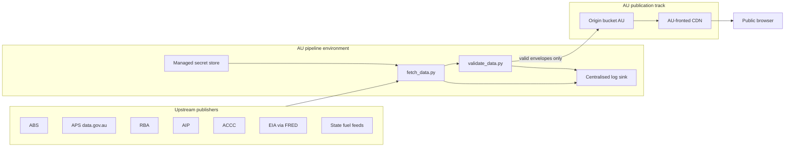

# ADR-0001: AU-hosted migration architecture and trigger-based cutover

- Status: proposed
- Date: 2026-04-21
- Decision scope: hosting, data pipeline location, and cutover conditions
  for the Fuel Resilience AU dashboard.

## 1. Context

The project currently runs as a static, public dashboard suitable for
GitHub Pages or equivalent static CDN. The stated end goal is a
government-grade National Fuel Dashboard with IRAP-ready controls. The
feasibility-phase posture is deliberately lightweight; a migration to
Australian sovereign hosting with hardened controls is required to pass
Gate C in [../compliance/phase-gates.md](../compliance/phase-gates.md).

Constraints:

- Priority order: accuracy > completeness > speed > user experience.
- The dashboard must remain static-host compatible until the migration
  lands, so no server-side runtime features are added in the meantime.
- The non-fabrication rule and envelope semantics must survive the move.
- Data sovereignty: any non-public or restricted data must be processed
  and stored in an Australian region (noting current scope is public-only).

## 2. Decision (proposed)

Adopt a two-track architecture:

1. **Publication track (public, current)**: static artefacts served from
   an AU-fronted CDN with an AU origin bucket. No change to envelope
   semantics or URL structure.
2. **Pipeline track (controlled)**: data pipeline relocates to an
   Australian sovereign managed environment with environment separation
   (dev, test, prod), secret management and centralised logging.

The two tracks are linked by a one-way publication step that copies
validated, public envelopes from the pipeline environment to the static
origin bucket. No user input crosses the boundary.

Target posture (Gate C onwards):

- Hosting region: Australia (AU).
- Platform family: a managed platform with published IRAP assessment or
  PROTECTED community cloud support, such that a future IRAP assessment
  is feasible. Final platform selection is deferred until the migration
  trigger fires; candidates are compared against a matrix at that time.
- Identity: SSO with MFA on all administrative accounts; least-privilege
  for CI.
- Secrets: managed secret store with documented rotation.
- Logging: events per [../compliance/audit-log-taxonomy.md](../compliance/audit-log-taxonomy.md)
  shipped to a centralised sink with 7-year retention.
- Monitoring: synthetic checks for SLO-1, SLO-3 and SLO-4.
- Resilience: multi-region failover within AU for the publication CDN;
  documented degraded/read-only mode behaviour.

## 3. Architecture (target)

Rules the diagram enforces:

- Only validator-approved envelopes reach the origin bucket.
- Secrets never leave the pipeline environment.
- Log events from both fetch and validator flow to the central sink.
- Users interact with the CDN only; no path from user to pipeline.

## 4. Cutover triggers

Migration executes when any one of the following triggers fires. Each
trigger requires reviewer confirmation and a dated entry in
[../compliance/risk-register.md](../compliance/risk-register.md).

1. **Traffic trigger**: sustained 28-day average of unique daily visits
   exceeding a threshold set at Gate B (initial placeholder: 5000 unique
   daily visits). Low-priority without a second trigger.
2. **Stakeholder trigger**: a named government or civil-society stakeholder
   requests a formal engagement that implies IRAP readiness within 12
   months.
3. **Sensitivity trigger**: scope expansion proposes any OFFICIAL:Sensitive
   or restricted field. Triggers Gate B re-entry plus immediate migration
   planning.
4. **Procurement trigger**: any procurement conversation advances to
   security questionnaire stage.
5. **Assurance trigger**: the project commits to an IRAP assessment window
   (irrespective of the above).

No migration occurs on the traffic trigger alone; at least one of triggers
2-5 must be present.

## 5. Cutover plan

Executed only after a trigger fires and Gate B has passed.

1. Select platform against the comparison matrix (to be drafted in the
   migration preparation PR).
2. Stand up dev/test/prod environments with SSO/MFA, secret store,
   centralised logs.
3. Replicate the data pipeline into the pipeline environment; run in
   parallel to the existing GitHub Actions refresh for a minimum of two
   refresh cycles to compare outputs byte-for-byte.
4. Switch publication: point the public DNS at the AU CDN; the repository
   becomes the source of pipeline code, but the origin bucket becomes the
   source of served artefacts.
5. Retire the GitHub Actions refresh schedule (keep CI for PR validation).
6. Run one live disaster recovery test (CTRL-22).
7. Record Gate C exit evidence in
   [../compliance/phase-gates.md](../compliance/phase-gates.md).

Rollback: retain the old GitHub Actions path and the previous origin for
one month. If SLOs regress beyond error budget in the first 28 days,
roll back DNS, preserving pipeline environment for diagnosis.

## 6. Alternatives considered

- **Remain on static-only indefinitely**: simpler but cannot meet IRAP or
  centralised-logging expectations. Rejected as a long-term posture.
- **Self-hosted VM in an AU region**: maximum control but increases
  operational burden and patch-SLA risk. Rejected for feasibility phase
  pending evidence that managed platforms cannot meet requirements.
- **Multi-cloud from day one**: adds complexity without a matching
  sensitivity or scale driver today. Deferred; revisit at Gate D.

## 7. Consequences

- Maintenance cost increases after Gate C due to platform, logging and
  monitoring spend.
- Release cadence slows for infrastructure-affecting changes (reviewer and
  evidence overhead).
- Reputational gain: the project can credibly claim AU-hosted, logged and
  IRAP-prepared posture.
- Future restricted-data expansion becomes feasible without a second
  migration.

## 8. Open questions (to resolve before Gate B signs off)

- Which managed platform best matches the control expectations at the
  smallest operational footprint?
- What is the final visitor threshold for the traffic trigger?
- Who holds the security reviewer role at cutover?
- What is the formal agreement for off-platform mirror location (see
  [../compliance/disaster-recovery.md](../compliance/disaster-recovery.md)
  section 5)?

## Change log

- 2026-04-21 - Initial ADR proposed.
