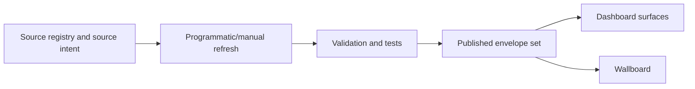

# Architecture Overview

## Overview

Fuel Resilience AU is a static multi-surface dashboard system built around a shared data envelope pipeline. Its architecture prioritises public clarity, repeatable validation, and safe degradation when sources are missing or delayed.

The same behavioural rules apply across all dashboard surfaces and the wallboard: verified values are shown, and unavailable values are labelled as unavailable.

## How It Works

The architecture separates concerns into source definition, envelope production, and presentation.

| Layer | Responsibility | Stability goal |
| --- | --- | --- |
| Source registry | Declares each source, retrieval mode, cadence, and rights context | One canonical record per source |
| Envelope production | Produces either verified values or explicit unavailable payloads | No fabricated data |
| Validation and CI | Enforces envelope and reference integrity | Fail loudly on contract drift |
| Presentation | Renders value or unavailable state consistently | No silent fallbacks |

## Key Decisions

- **Shared contract across all surfaces**: one envelope shape improves consistency between dashboards and the wallboard.
- **Validation-driven publishing**: structural integrity is treated as a release gate rather than an optional quality check.
- **Graceful degradation by design**: operational continuity is maintained even when only part of the source estate is available.

## Failure Scenarios

- **Registry and envelope drift**: mismatched identifiers or metadata blocks publication until corrected.
- **Scheduled refresh succeeds partially**: only valid outputs become visible; unavailable states remain explicit for failed inputs.
- **Cross-surface inconsistency risk**: reduced by enforcing one contract and one validator for all surfaces.

## Related

- [Fuel Resilience Wiki](../index.md)
- [Getting Started](../getting-started.md)
- [Data Sources](../integrations/data-sources.md)
- [Project Quirks](../quirks.md)
