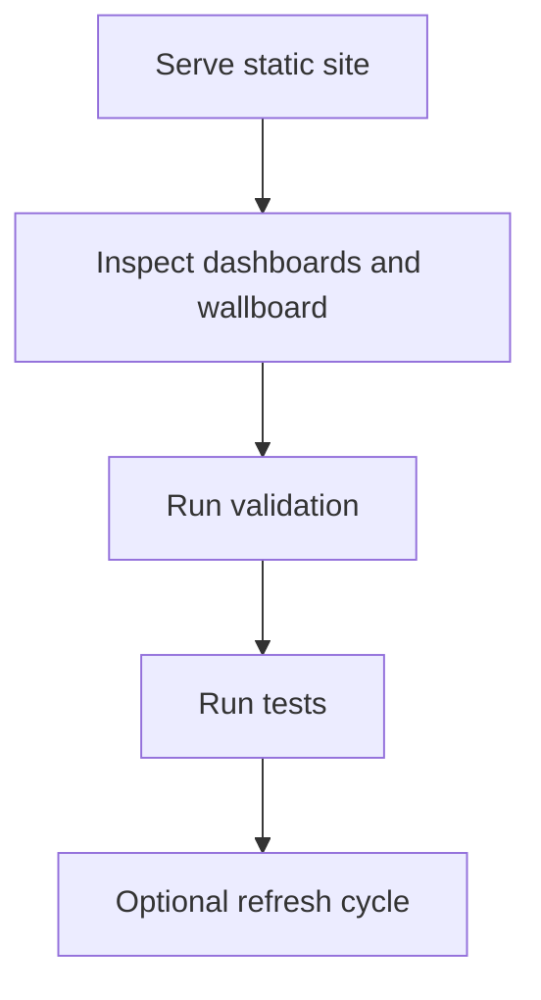

# Getting Started

## Overview

This guide explains how to run, validate, and refresh the project safely without changing application behaviour. It is aimed at maintainers who need predictable local checks and confidence that dashboard output remains aligned with named sources.

## How It Works

Use a simple static server for UI viewing, then run validation and tests before proposing any data or docs change.

| Activity | Intent | Typical outcome |
| --- | --- | --- |
| Serve locally | View dashboard and wallboard surfaces with real envelope loading behaviour | Pages render from local static files |
| Validate data | Confirm source registry and envelope semantics | Fails fast on schema or status mismatches |
| Run tests | Confirm deterministic script behaviour | Prevents regressions in pipeline logic |
| Refresh sources | Update programmatic/manual envelopes where possible | Data updates or explicit unavailable states |

## Key Decisions

- **Static-first local workflow**: mirrors production delivery constraints and avoids hidden runtime dependencies.
- **Validation before merge**: catches structural errors early so unreliable data never appears as valid.
- **Deterministic tests in normal workflow**: keeps ingestion and envelope behaviour stable during routine maintenance.

## Failure Scenarios

- **Local pages opened without a server**: data loading fails; use a static server so envelopes can be read correctly.
- **Validation failures after a source update**: treat as a contract mismatch, not a cosmetic error; correct data or metadata before continuing.
- **Refresh completes with unavailable outputs**: indicates unresolved upstream access or extraction issues; retain unavailable state until verified.

## Related

- [Fuel Resilience Wiki](index.md)
- [Architecture Overview](architecture/overview.md)
- [Data Sources](integrations/data-sources.md)
