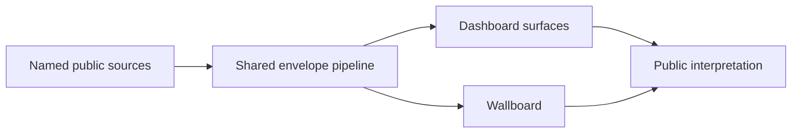

# Fuel Resilience Wiki

## Overview

This wiki explains the intent and operating model of Fuel Resilience AU. It focuses on what the dashboards are for, how information moves from sources to published views, and why unavailable data is shown explicitly rather than estimated.

The project serves public-interest monitoring across fuel and fertiliser risks, with four dashboard views and a continuous wallboard view sharing one data model.

## How It Works

The platform joins five surfaces around a shared data contract:

| Surface | Purpose |
| --- | --- |
| Fuel | Tracks fuel import and retail pressure signals. |
| Fertilizer | Tracks import exposure and concentration risk. |
| Oil and production | Tracks crude benchmarks, domestic production context, and policy signals. |
| Who pays what | Tracks tax and pricing context for major energy participants. |
| Wallboard | Keeps an always-on cross-domain operational summary. |

## Key Decisions

- **Single shared envelope model**: one contract across all surfaces reduces interpretation drift and keeps unavailable handling consistent.
- **Explicit unavailable states**: missing data is presented as unavailable, not inferred, to preserve trust and source integrity.
- **Static delivery model**: static pages and static envelopes keep hosting simple and transparent for public review.

## Failure Scenarios

- **Source publication changes unexpectedly**: a source may stop yielding usable data; affected metrics remain unavailable until revalidated.
- **Partial refresh success**: some sources update while others fail; dashboards continue rendering with mixed fresh/unavailable cards.
- **No verified data on a surface**: the surface stays readable but does not display a misleading freshness signal.

## Related

- [Getting Started](getting-started.md)
- [Architecture Overview](architecture/overview.md)
- [Data Sources](integrations/data-sources.md)
- [Project Quirks](quirks.md)
