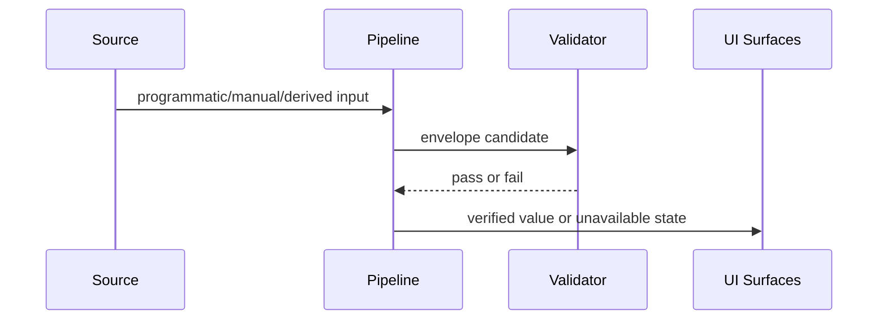

# Data Sources

## Overview

This page explains how external and manually maintained data sources feed the dashboards and wallboard. The integration model is intentionally mixed: programmatic retrieval where reliable, and manual verification where source format, rights, or quality constraints require human judgement.

## How It Works

Each source is assigned a retrieval mode and published through the same envelope contract.

| Retrieval mode | When it is used | Behaviour |
| --- | --- | --- |
| Programmatic | Source can be fetched and parsed reliably | Produces generated envelopes on refresh |
| Manual | Source requires human extraction or verification | Maintainer-curated envelopes are refreshed with metadata checks |
| Unavailable | No safe reproducible path to a verified value yet | Envelope remains intentionally unavailable |
| Derived | Value is computed from another verified source | Published only when parent data is valid |

## Key Decisions

- **Mixed ingestion strategy**: balances freshness with source integrity, rather than forcing full automation.
- **Rights-aware handling**: source rights and citation context are retained so redistribution assumptions are not made implicitly.
- **Derived outputs require valid parents**: prevents derived metrics from appearing when their upstream basis is stale or missing.

## Failure Scenarios

- **Programmatic endpoint breaks**: affected source is not silently substituted; output remains unavailable until repaired.
- **Manual extraction confidence is low**: source is held unavailable rather than publishing uncertain numbers.
- **Derived dependency missing**: derived envelope does not publish as valid until the parent source is restored.

## Related

- [Fuel Resilience Wiki](../index.md)
- [Architecture Overview](../architecture/overview.md)
- [Project Quirks](../quirks.md)
