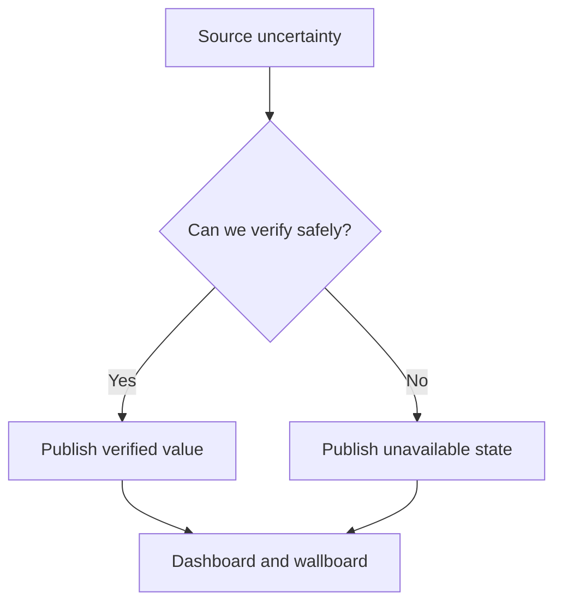

# Project Quirks

## Overview

This page captures non-obvious behaviours that are intentional and easy to misread during maintenance. These quirks are not defects; they reflect explicit decisions about trust, public transparency, and static delivery constraints.

## How It Works

The project prefers conservative behaviour whenever uncertainty appears in source availability, source rights, or extraction confidence.

| Quirk | Why it exists | Practical effect |
| --- | --- | --- |
| Unavailable is first-class | Avoids fabricated precision | Some cards remain empty even during active refresh periods |
| Mixed source freshness | Sources publish on different cadences | A surface can show both recent and older verified signals |
| Wallboard shares same data contract | Keeps interpretation aligned across surfaces | Wallboard never bypasses quality rules |
| Scheduled refresh and CI are separate concerns | Operational refresh differs from merge quality gates | Data refresh can run routinely while development checks remain strict |

## Key Decisions

- **No estimation policy**: public-facing metrics only appear when traceable to a named source path.
- **Contract consistency over visual completeness**: rendering rules do not change to make a page look fuller.
- **Operational honesty over headline freshness**: stale or blocked sources are visible as such, not masked.

## Failure Scenarios

- **Maintainer expects every card to populate after refresh**: not guaranteed; source quality and accessibility still govern output.
- **A source appears reachable but not parseable**: envelope may stay unavailable despite nominal reachability.
- **Observed mismatch between surfaces**: usually cadence or source-mode differences, not independent logic per page.

## Related

- [Fuel Resilience Wiki](index.md)
- [Architecture Overview](architecture/overview.md)
- [Data Sources](integrations/data-sources.md)
